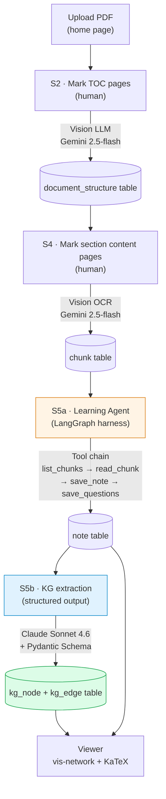

# Self-Study System

A single-user, clone-and-run local web tool that turns any PDF textbook into
a **knowledge graph + Markdown notes**. Upload a PDF, mark chapter boundaries,
and the system auto-generates a navigable KG and readable notes — all locally,
no cloud, no account.

---

## Architecture



- **Human-anchored boundaries** (S2 / S4): user spends 5 seconds marking
  chapter page ranges, replacing fully-autonomous agents that drift on
  OCR-degraded scans.
- **LangGraph agent harness** (S5a): StateGraph `agent ↔ tool_node` loop
  drives note generation through a 4-tool chain.
- **Strict-contract KG extraction** (S5b): Pydantic Schema ×
  `with_structured_output()` × server-side validation to drop hallucinated
  relations.

---

## What it does

- **Upload PDF**: your textbook stays local (never committed to git).
- **Extract TOC**: pick the table-of-contents pages, an LLM extracts the
  full chapter structure in one shot.
- **Section OCR**: pick a section's content pages, a vision LLM OCRs them
  into clean markdown.
- **Generate notes**: an LLM produces a markdown study note per section
  (LaTeX math supported).
- **Build knowledge graph**: concepts and relations are extracted from each
  note and visualized via vis-network.
- **Export notes**: one-click zip download (one `.md` per section,
  Obsidian / Typora friendly).

Everything happens in the browser after install; the terminal is only used
for setup.

---

## Prerequisites

| Tool | Purpose |
|---|---|
| Python ≥ 3.11 | Backend runtime |
| [uv](https://docs.astral.sh/uv/) | Dependency management |
| One or more LLM provider API keys | See below |
| A modern browser | Viewer frontend |

> **Windows users**: PowerShell launch scripts (`.ps1`) are provided —
> **no Git Bash or WSL needed**. First-time setup has 3 small steps,
> see the [Windows quickstart](#windows-quickstart) below.

The project routes LLM calls through LangChain abstractions, so you can
configure any provider's key in `.env`:

- `ANTHROPIC_API_KEY` — [get a key](https://console.anthropic.com/)
- `GOOGLE_API_KEY` — [get a key](https://aistudio.google.com/app/apikey)

> **Note**: an API key is for **per-token paid API calls**, completely
> separate from each vendor's web/desktop chat subscription products
> (if any) — those do not cover API usage.

---

## Windows quickstart

> macOS / Linux users can skip this section.

### 1. Install uv

Run in PowerShell (no admin required):

```powershell
powershell -ExecutionPolicy ByPass -c "irm https://astral.sh/uv/install.ps1 | iex"
```

**Close and reopen PowerShell** after install (to refresh PATH), then
verify with `uv --version`.

### 2. Unlock script execution policy

Windows blocks `.ps1` scripts by default. Run once in PowerShell:

```powershell
Set-ExecutionPolicy -Scope CurrentUser RemoteSigned
```

Type `Y` to confirm. This only affects the **current user** and allows
local + signed scripts to run; it does not affect other users on the
system.

### 3. (Optional) Install PowerShell 7+

The built-in PowerShell 5.1 on Windows is sufficient. If you want better
Unicode support and modern syntax, get PowerShell 7+ from
[aka.ms/powershell](https://aka.ms/powershell).

### Common Windows errors

| Error | Cause | Fix |
|---|---|---|
| `uv: not recognized as an internal or external command` | uv not installed / PATH not refreshed | Close and reopen PowerShell, or reinstall (step 1) |
| `cannot be loaded because running scripts is disabled` | ExecutionPolicy not unlocked | Run step 2 |
| `ModuleNotFoundError: No module named 'pymupdf'` (or others) | Ran `.\run.ps1` before `.\setup.ps1` | Run `.\setup.ps1` first |
| Garbled Chinese in console output | PowerShell output encoding is not UTF-8 | Run `chcp 65001`, or use PowerShell 7+ |
| `git pull` reports lockfile conflict | `uv.lock` conflict from multi-machine work | Run `uv sync` to re-resolve |

---

## One-time install

```bash
git clone https://github.com/liutaotongxue/self_study_system.git
cd self_study_system
```

**macOS / Linux**:

```bash
bash setup.sh
```

**Windows (PowerShell)**:

```powershell
.\setup.ps1
```

Either script will:
1. `uv sync` to install dependencies.
2. Copy `.env.example` → `.env` (only if it doesn't exist).
3. `alembic upgrade head` to create the local SQLite DB.

When done, follow the prompt to edit `.env` and fill in
`ANTHROPIC_API_KEY` and `GOOGLE_API_KEY`.

---

## Run

**macOS / Linux**:

```bash
bash run.sh
```

**Windows (PowerShell)**:

```powershell
.\run.ps1
```

Open your browser at `http://localhost:8000/`. The server binds to
`127.0.0.1:8000` and is **not exposed to the network** (single-machine,
single-user).

---

## Workflow

| Step | Where | What |
|---|---|---|
| 1 | Home page `/` | Upload PDF (registered only, not parsed yet) |
| 2 | Viewer `/index.html?doc=N` → Chapter status | Enter TOC page range (e.g. `7-10`) → LLM extracts the full structure |
| 3 | Chapter status page | Fill in a section's content pages (e.g. `28-35`) → preview thumbnails to confirm → vision OCR + chunking |
| 4 | Chapter status page | Click "Generate" → LLM produces markdown notes + KG |
| 5 | Viewer | Browse the graph, click nodes to read notes, export notes zip |

---

## Tech stack

| Layer | Tech |
|---|---|
| Backend | FastAPI + SQLAlchemy 2.0 + Alembic + SQLite |
| LLM orchestration | LangGraph + LangChain (multi-provider abstraction) |
| PDF processing | pymupdf |
| Frontend | Vanilla HTML/JS + marked (markdown) + KaTeX (math) + vis-network (KG) |

Zero bundling / zero build steps — the frontend is just three static HTML
files.

---

## Project layout

```
self_study_system/
├── setup.sh / run.sh           Install + launch (POSIX)
├── setup.ps1 / run.ps1         Install + launch (Windows)
├── pyproject.toml              Dependency declaration
├── alembic/ + alembic.ini      DB schema migration chain
├── src/sla/                    Backend source
│   ├── api/                    FastAPI routes
│   ├── models/                 SQLAlchemy models
│   ├── harness/                LangGraph agent harness + KG extraction
│   ├── parsing/                PDF rendering / TOC / content OCR
│   └── runtime/                runner / task / event
├── web/                        Frontend (index.html / library.html / process.html)
├── scripts/                    CLI tools (ingest / study_book / build_kg / ...)
└── tests/                      pytest suite
```

Local data: `app.db` (SQLite) and the absolute paths to user PDFs. Neither
is committed to git.

---

## Development

```bash
# Hot reload (auto-restart on code change)
uv run uvicorn sla.api.app:app --reload

# Run tests (71 tests)
uv run pytest tests/

# DB migration (after editing models)
uv run alembic revision --autogenerate -m "..."
uv run alembic upgrade head
```

Main CLI tools (all under `scripts/`):

| Script | Purpose |
|---|---|
| `ingest_pdf.py` | Offline PDF ingestion into the DB (equivalent to web upload + TOC extraction) |
| `study_book.py` | Generate markdown notes for a chapter offline |
| `build_kg.py` | Extract KG for a chapter offline (supports `--clear` to prevent accumulation) |
| `run_generation.py` | Executor for UI-triggered generation jobs (background Popen) |

---

## Uninstall

The project is fully self-contained. To uninstall, just remove the
directory:

```bash
# macOS / Linux / Git Bash
rm -rf self_study_system

# Windows PowerShell
Remove-Item -Recurse -Force self_study_system
```

All data (`app.db`, `.env`, `.venv/`, `uploads/`) lives inside the project
directory and will be removed together. **No** system-level files,
services, or global packages are left behind.

Optional extra cleanup:

- Done with all LLM projects → log in to your API key provider's console
  and revoke the key (prevents leaked-key abuse charges).
- Done with all uv projects → `uv cache clean` or `rm -rf ~/.cache/uv`.

---

## License

[MIT](LICENSE) © 2026 liutao

---

## Acknowledgements

Inspiration and references:
- [Nous Research Hermes Agent](https://github.com/NousResearch/hermes-agent)
  — reference for LangGraph harness design.
